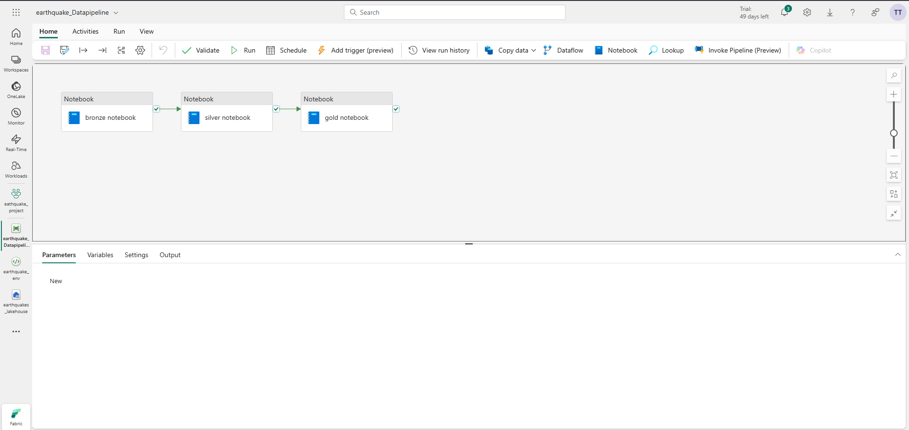
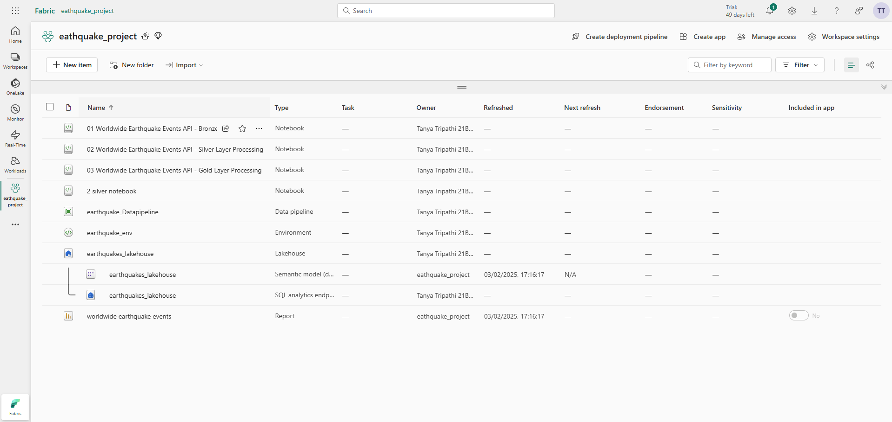
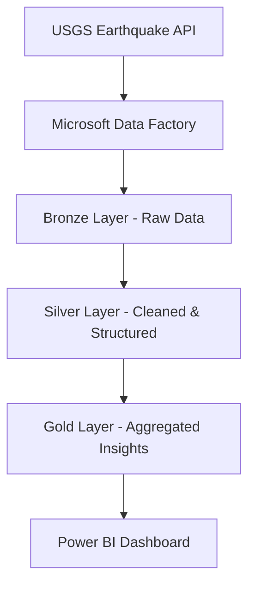

# 🌍 fabric-earthquake-realtime-analysis

End-to-end data pipeline built using Microsoft Fabric's Data Factory, Data Engineering (Lakehouse), and Power BI. It ingests worldwide earthquake data from the USGS API, processes it through Bronze–Silver–Gold layers using PySpark notebooks, and presents insightful dashboards using Power BI.

---

## 🖼️ Gallery – Quick Preview

**Daahboard**  


**Data Pipeline Overview**  


**Workspace Overview**  


---

## 🛠️ Project Overview

This project demonstrates a modern data engineering stack using Microsoft Fabric for real-time analysis of global earthquake data. Data is ingested from the [USGS Earthquake Feed](https://earthquake.usgs.gov/fdsnws/event/1/), processed through a structured Medallion Architecture (Bronze → Silver → Gold), and visualized in Power BI for insights into seismic activity patterns.

---

## 🧰 Tech Stack

- **Microsoft Fabric** – Unified platform for data engineering and analytics
- **Data Factory** – Pipelines for automated data ingestion
- **OneLake + Lakehouse** – Scalable storage and Delta Lake support
- **PySpark Notebooks** – Data transformation and cleansing
- **Power BI** – Interactive visualization and reporting
- **USGS API** – Real-time earthquake data source

---

## 🏗️ Architecture



---

## 📁 Notebooks Overview

### 🔹 Bronze Layer (`BronzeLayerProcessing.ipynb`)

```python
# Load raw data from USGS
url = "https://earthquake.usgs.gov/earthquakes/feed/v1.0/summary/all_day.geojson"
df_raw = spark.read.option("multiline", "true").json(url)

# Write to Bronze table
df_raw.write.format("delta").mode("overwrite").saveAsTable("lakehouse.bronze_earthquake")
```

### ⚪ Silver Layer (`SilverLayerProcessing.ipynb`)

```python
# Read from Bronze
df_bronze = spark.read.table("lakehouse.bronze_earthquake")

# Clean and select necessary fields
df_silver = df_bronze.selectExpr("properties.mag as magnitude", 
                                 "properties.place as location", 
                                 "geometry.coordinates[0] as longitude", 
                                 "geometry.coordinates[1] as latitude", 
                                 "properties.time as timestamp")                      .filter("magnitude IS NOT NULL")

# Write to Silver table
df_silver.write.format("delta").mode("overwrite").saveAsTable("lakehouse.silver_earthquake")
```

### 🟡 Gold Layer (`GoldLayerProcessing.ipynb`)

```python
# Read from Silver
df_silver = spark.read.table("lakehouse.silver_earthquake")

# Aggregation logic
df_gold = df_silver.groupBy("location").agg(
    avg("magnitude").alias("avg_magnitude"),
    count("*").alias("quake_count")
)

# Write to Gold table
df_gold.write.format("delta").mode("overwrite").saveAsTable("lakehouse.gold_earthquake_summary")
```

---

## 📊 Power BI Dashboard

- Connects directly to Gold layer tables in OneLake
- Visualizes:
  - Earthquakes by magnitude and location
  - Daily/weekly/monthly trends
  - Heatmaps and severity distributions

---

## ✅ Setup & Usage

### 1. Clone the Repo

```bash
git clone https://github.com/Tanya0139/fabric-earthquake-realtime-analysis.git
```

### 2. Configure Data Factory

- Create a pipeline to pull data from the USGS API and load into the Bronze Lakehouse table.

### 3. Run PySpark Notebooks in Microsoft Fabric

Run each notebook in order:
1. `BronzeLayerProcessing.ipynb`
2. `SilverLayerProcessing.ipynb`
3. `GoldLayerProcessing.ipynb`

### 4. Connect Power BI

- Use **Get Data → OneLake**
- Load `lakehouse.gold_earthquake_summary` and build reports

---

## 💡 Notes

- Ensure your workspace has access to the Microsoft Fabric features (Data Engineering + Power BI).
- API limits may apply depending on frequency of requests to USGS.
- Schedule notebooks or pipelines for periodic updates to support near real-time analysis.
